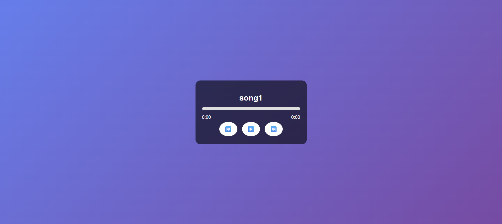

# 🎵 Music Player App

A simple **HTML + CSS + JavaScript Music Player** that lets you play, pause, skip, and control songs with a progress bar and time display.

---

## 📂 Project Structure

```music-player/
│── index.html
│── style.css
│── script.js
│── songs/
├── song1.mp3
├── song2.mp3
└── song3.mp3
```


---

## 🚀 Features
- ▶️ Play / ⏸ Pause songs  
- ⏮ Previous / ⏭ Next track  
- 📊 Progress bar with seek control  
- ⏱ Current time and duration display  
- 🔄 Auto play next song  

---

## 🛠 How to Run
1. Download this project folder.  
2. Put your `.mp3` files inside the `songs/` folder.  
3. Rename them as `song1.mp3`, `song2.mp3`, `song3.mp3`  
   *(or update the `songs` array in `script.js`).*  
4. Open `index.html` in your browser.  
5. Enjoy 🎶  

---

## 💡 Future Enhancements
- Album cover with rotating animation.  
- Playlist with unlimited songs.  
- Shuffle & repeat options.  
- Volume control slider.  
- Mobile responsive design.  

---

## 📸 Preview


---

## 📜 License
This project is free to use for learning and personal projects.
